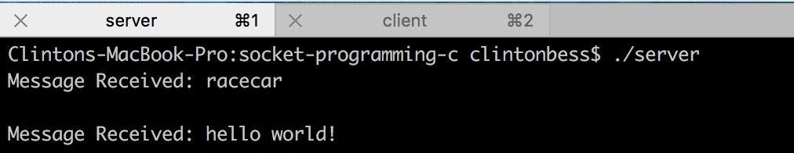
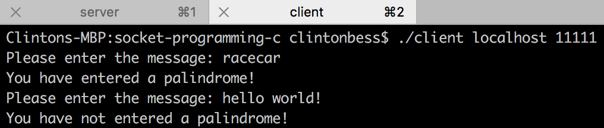

# socket-programming-c

<div style="text-align:center"></div>
<div style="text-align:center"></div>

## Installation
- First clone this repository by navigating to your projects directory and entering the following command into your terminal:
```
git clone https://github.com/clintonbess/socket-programming-c.git
```
- Navigate to the socket-example directory:
```
cd socket-programming-c
```
- Compile the server program:
```
gcc server.c -o server
```
- Compile the client program:
```
gcc client.c -o client
```
- Run the server:
```
./server
```
- Run the client(s) (values for the port can be 11111, 22222, 33333, or 44444):
```
./client localhost <port>
```
